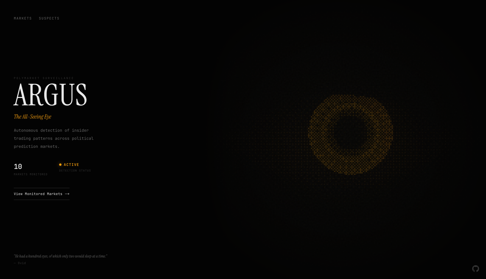
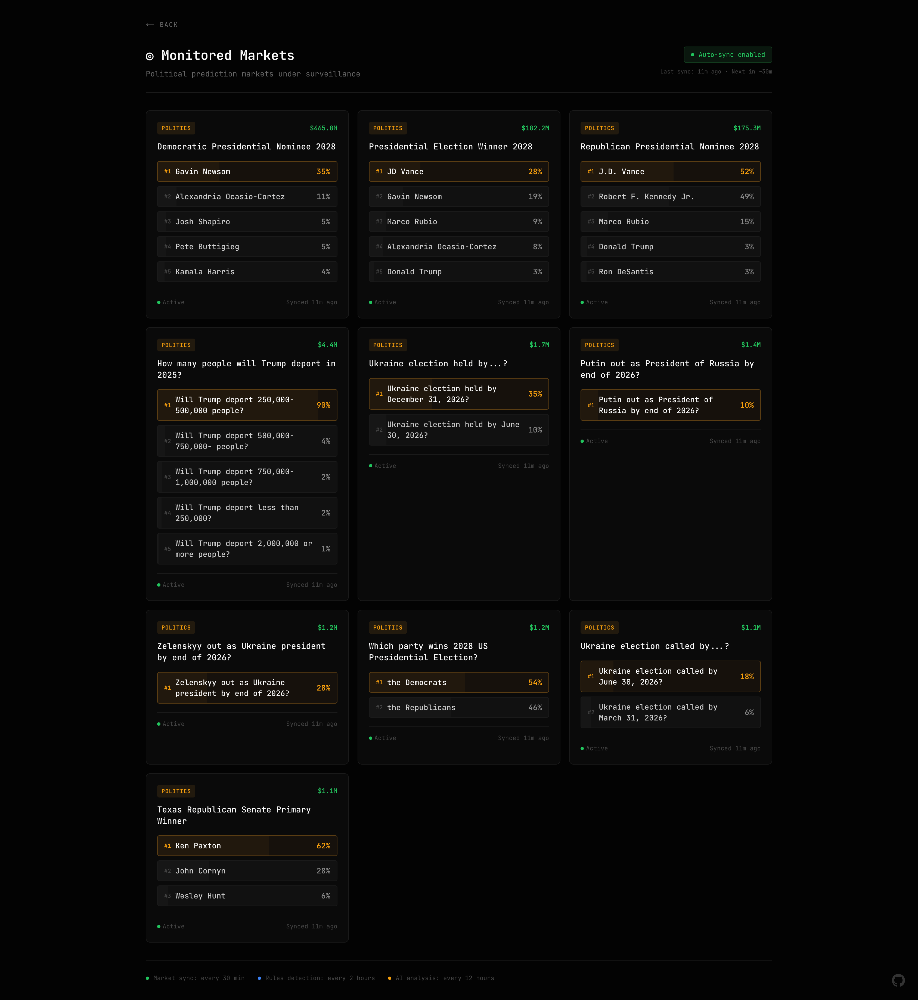
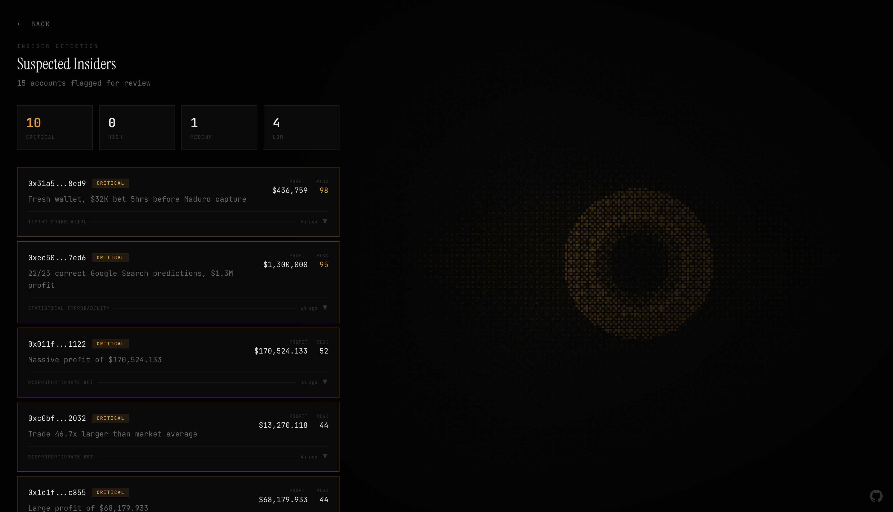

# Argus

An AI agent that monitors political prediction markets for insider trading.

**Live Demo:** [argus-watch.vercel.app](https://argus-watch.vercel.app)

## The Problem

Prediction markets have no insider trading oversight. Recent examples:

- **Maduro Capture (Jan 2026)** — Someone turned $32K into $436K betting on Maduro's capture, hours before it was announced. The account was weeks old with only Venezuela bets.
- **Google Insider (Dec 2025)** — A trader made $1M+ by predicting 22/23 Google Year in Search results. The same account predicted Gemini 3.0's exact release date.

These patterns go undetected because no one is watching.

## The Solution

Argus uses Claude AI to monitor markets 24/7 and flag suspicious accounts. It detects:
- Unusual win rates
- Disproportionate bets
- Suspicious timing around announcements

The AI surfaces patterns with full evidence. Humans make the final call.

## Tech Stack

- **Frontend:** Next.js 15, React 19, Tailwind CSS
- **Backend:** Convex
- **AI:** Claude via AWS Bedrock
- **Data:** Polymarket API

## Setup

```bash
git clone https://github.com/salimmohamed/colorstackwinterhack2025-argus.git
cd colorstackwinterhack2025-argus
bun install
```

Create `.env.local`:
```
NEXT_PUBLIC_CONVEX_URL=your_convex_url
AWS_REGION=us-east-1
AWS_ACCESS_KEY_ID=your_key
AWS_SECRET_ACCESS_KEY=your_secret
```

Run:
```bash
npx convex dev
bun dev
```

## Demo

**Video:** [Watch Demo](submission/colorstack-presentation.mp4)

**Slides:** [Google Slides](https://docs.google.com/presentation/d/1addiylHOo_d3bkdP2ezX_5gHC3CqK1bMmh5AjOXBrLs/edit?usp=sharing) | [PowerPoint](submission/Colorstack%20Hackathon%20Presentation.pptx)

## Screenshots







## Future

- **Smarter Detection** — Train on historical insider cases to improve pattern recognition
- **Multi-Platform** — Expand beyond Polymarket to Kalshi, PredictIt, and other prediction markets
- **Real-Time Alerts** — Push notifications when high-confidence insider activity is detected
- **Network Analysis** — Track wallet connections to identify coordinated trading rings
- **Public API** — Let researchers and journalists query flagged accounts

## Team

**Salim Mohamed** — Oregon State University

Built for ColorStack Winter Hackathon 2025.
